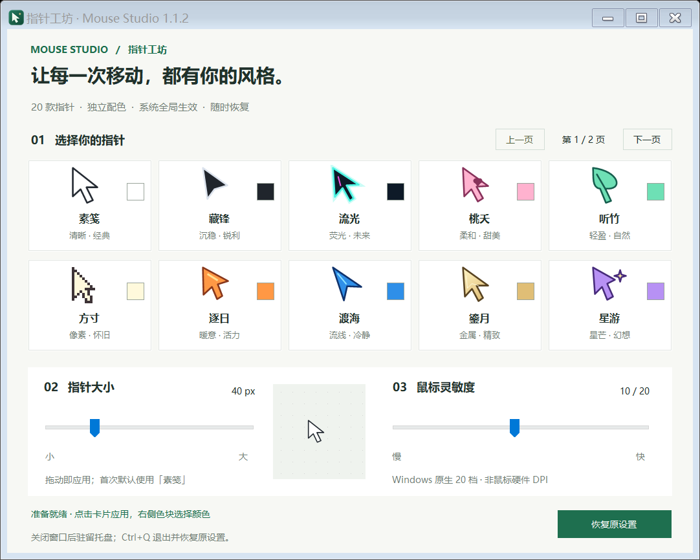
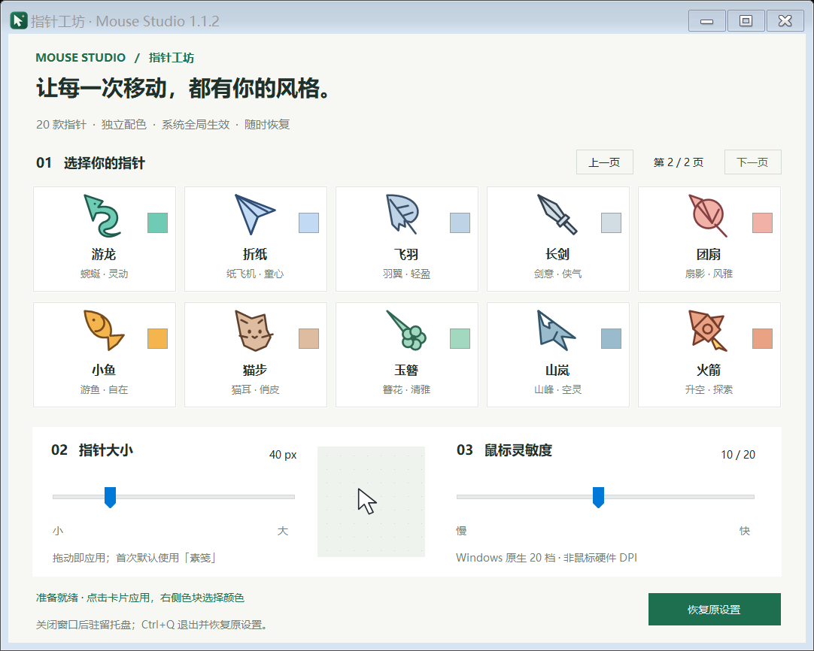

<p align="center"></p>

# Mouse Studio · 指针工坊

[简体中文](README.md) | **English**

A lightweight Windows desktop app for personalizing your actual system cursor. Choose a shape, customize its color, and adjust pointer size and mouse speed in real time.

**If you find this little app useful, please give it a ⭐ Star!**




## Download

Get `MouseStudio.exe` from the [latest release](https://github.com/kaixuan2694/mouse-studio/releases/latest) and double-click it. The ZIP download also includes documentation, the recovery script, and the MIT license.

Built for Windows 10 / 11 with .NET Framework 4.x. No installation, administrator privileges, or internet connection required. **The application interface is currently in Simplified Chinese; this page provides English instructions.**

## Features

- **20 original cursor shapes across two pages:** classic arrows, a crisp pixel arrow, a paper plane, feather, sword, fan, fish, cat, flower hairpin, mountain, rocket, and more.
- **Independent colors:** use the small color button on the right of each card to choose a preset, pick a custom color, or restore that shape's default palette. Colors are saved separately for each style.
- **Pointer size:** adjust the cursor canvas from 24 to 96 px while preserving its click hotspot.
- **Mouse sensitivity:** adjust all 20 native Windows pointer-speed levels while preserving the existing acceleration setting.
- **14 system cursor roles:** includes normal selection, text selection, links, resizing, moving, busy, unavailable, and help states.
- **Tray support and recovery:** close the window to keep the app running in the notification area. With `Ctrl+Q` or the tray menu, exit, reload the saved Windows cursor theme, and restore the mouse speed captured at startup. Recovery avoids potentially invalid temporary cursor copies.
- **A consistent app icon:** a forest-green tile with a light pointer and a small golden star, embedded in the EXE at nine resolutions for Explorer, desktop shortcuts, the window, and the tray.

## Quick guide

1. Click a cursor card to apply it to Windows immediately.
2. Use **上一页 / 下一页** to switch pages. Changing pages keeps your active cursor selected.
3. Click a card's small color swatch. **自选颜色…** opens the color picker; **恢复这款默认配色** restores that style's default colors. Editing the active style updates the system cursor immediately; other styles apply when selected.
4. Drag **指针大小** to resize the pointer, and **鼠标灵敏度** to change its speed.
5. Click **恢复原设置** to reload the saved Windows cursor theme and restore the speed captured when the app started. Saved color preferences are kept. Unsaved temporary cursor changes from other apps are not restored.
6. Closing the window sends the app to the system tray. Double-click its icon to reopen it, or right-click and choose **退出并恢复** to exit and restore. You can also press `Ctrl+Q` in the app window.

Before upgrading, exit the old version using its tray menu, then open the new EXE.

## Behavior and limitations

- Sensitivity changes **Windows pointer speed**, not the mouse's hardware DPI.
- Software that draws its own cursor or consumes raw mouse input may not follow Windows cursor or speed settings.
- Busy indicators are static rings in this version.
- The app does not install a permanent cursor theme or configure automatic startup. Reopen it and choose a style after signing out or restarting Windows.
- If the process is forcibly terminated, reopening the app first reloads the saved Windows cursor theme and restores the backed-up speed. With the app stopped, `MouseStudio.exe --restore` does the same. Unsaved temporary cursor changes made by other apps cannot be recovered through this fallback.
- The app stores recovery information and per-style color preferences in `%LOCALAPPDATA%\MouseStudio`. It does not collect mouse movement or send data over the network.

## Build from source

Run in PowerShell on Windows:

```powershell
git clone https://github.com/kaixuan2694/mouse-studio.git
cd mouse-studio
.\build.ps1
.\MouseStudio.exe
```

The build uses the .NET Framework C# compiler included with Windows. No NuGet or third-party packages are required. The cursor artwork and app icon are embedded in the executable; external image files are not needed to run it.

The editable icon artwork is in `assets/mouse-studio.svg`. To regenerate the matching PNG / ICO files with the included C# generator and rebuild the app:

```powershell
.\build.ps1 -RebuildIcon
```

## Validation

```powershell
# Render both window pages without applying mouse settings
Start-Process .\MouseStudio.exe -ArgumentList '--preview' -Wait

# Exercise the real Windows cursor and speed settings, then restore them
Start-Process .\MouseStudio.exe -ArgumentList '--self-test' -Wait
Get-Content .\test-results.txt
```

Exit any running instance before running `--self-test`. This test temporarily changes the computer's mouse settings and attempts restoration in a `finally` block, including when a test fails.

Coverage includes 20 styles × 3 sizes × 14 system cursor roles, hotspot checks, speed readback, comparison of the original and restored cursor images and masks, page navigation, independent colors, actual system color updates, sliders, tray behavior, and exit.

Run `tools/test-exit.ps1` for a separate-process exit regression test. It verifies actual cursor rendering after the app process has ended, including an initially invisible cursor, normal exit, tray exit, a pending size update, exceptional cleanup, and repeated restoration. It also checks the active cursor returned by `GetCursorInfo`. Exit running instances first; the test temporarily changes mouse settings and reloads the saved theme on completion.

## Contributing

Bug reports, new cursor ideas, and pull requests are welcome. Please include your Windows version and reproduction steps when reporting a problem.

## License

[MIT](LICENSE) © 2026 kaixuan2694
